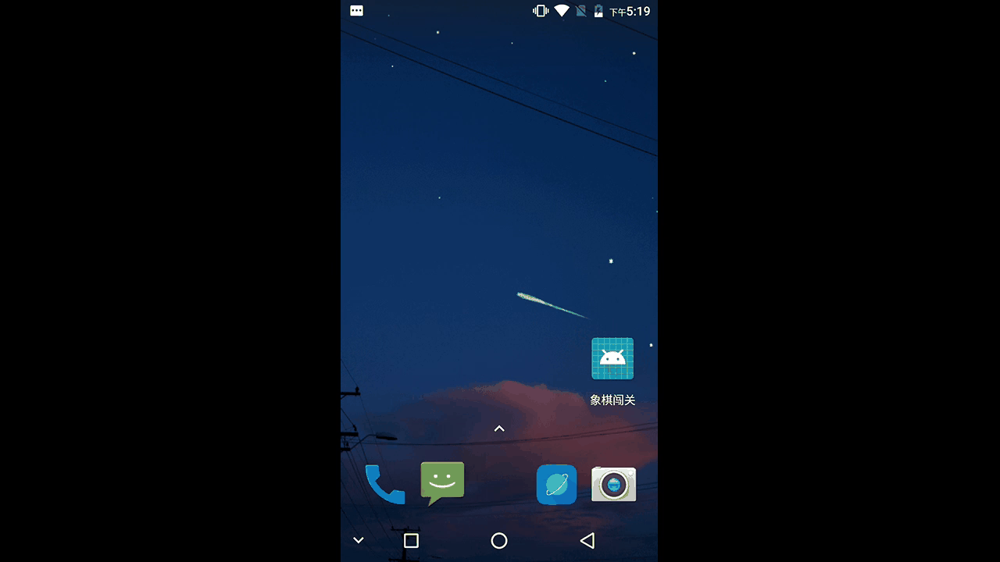

# GifWallpaper

当你看到美丽的GIF动画无缝循环播放时，你有没有想过是否可以将其用作Android设备上的动态壁纸呢？ 嗯，这个demo可以


## 描述壁纸
动态壁纸需要一个描述它的文件。 创建一个名为res / xml / wallpaper.xml的新XML文件，并使用以下XML替换其内容：

```xml
  <?xml version="1.0" encoding="UTF-8"?>
  <wallpaper
    xmlns:android="http://schemas.android.com/apk/res/android"
    android:label="GIF Wallpaper"
    android:thumbnail="@mipmap/ic_launcher">
  </wallpaper>
```

## 注册服务
需要在AndroidManifest.xml添加使用android.permission.BIND_WALLPAPER权限的服务，代码如下：

```xml
   <service
       android:name=".FreeWallpaperService"
       android:enabled="true"
       android:label="Free Wallpaper"
       android:permission="android.permission.BIND_WALLPAPER" >
         <intent-filter>
             <action android:name="android.service.wallpaper.WallpaperService"/>
         </intent-filter>
         <meta-data
              android:name="android.service.wallpaper"
              android:resource="@xml/wallpaper" >
          </meta-data>
    </service>
```
接下来，要确保应用程序只能安装在可以运行动态壁纸的设备上，请将以下代码片段添加到清单中：

```xml
<uses-feature
    android:name="android.software.live_wallpaper"
    android:required="true" >
</uses-feature>
```
## 创建服务
创建一个新的Java类并将其命名为  GIFWallpaperService.java。 这个类继承WallpaperService
因为  WallpaperService是一个抽象类，你必须重写它的onCreateEngine方法并返回一个自己的实例Engine，它可以渲染GIF的帧。

要使用GIF动画，您首先必须将其转换为Movie对象。 可以使用Movie类的decodeStream方法来执行此操作。 一旦Movie对象被创建，把它作为一个参数传递给自定义Engine的构造函数。
```java
public class FreeWallpaperService extends WallpaperService {

    @Override
    public WallpaperService.Engine onCreateEngine() {
        try {
            Movie movie = Movie.decodeStream(
                    getResources().getAssets().open("star.gif"));

            return new GIFWallpaperEngine(movie);
        }catch(IOException e){
            Log.w("GIF", "Could not load asset");
            return null;

        }
    }
   ...//engine
}
```

## 创建Engine
我们现在就开始使用Engine工作。 在GIFWallpaperEngine类中创建一个名为GIFWallpaperService的类并继承WallpaperService.Engine。

将以下字段添加到此新类中：

frameDuration：该整数表示重绘操作的延迟时间。 值为20，每秒可以提供50帧。
visible：这个布尔值允许engine知道动态壁纸当前在屏幕上是否可见。 这很重要，因为当不可见时，我们不应该绘制壁纸。
movie：这是一个Movie对象形式的GIF动画 。
holder：这是指向可用于engine的SurfaceHolder对象。 必须通过重写onCreate方法来初始化它。
handler：这是一个Handler对象，用来启动一个Runnable来负责实际绘制壁纸对象。

```java
private class GIFWallpaperEngine extends WallpaperService.Engine {
    private final int frameDuration = 20;
 
    private SurfaceHolder holder;
    private Movie movie;
    private boolean visible;
    private Handler handler;
 
    public GIFWallpaperEngine(Movie movie) {
        this.movie = movie;
        handler = new Handler();
    }
 
    @Override
    public void onCreate(SurfaceHolder surfaceHolder) {
        super.onCreate(surfaceHolder);
        this.holder = surfaceHolder;
    }
}
```

接下来，创建一个名为draw的方法来绘制GIF动画的内容。 该方法分解为：

我们首先检查visible变量是否设置为  true。 如果为true，我们才继续下去。
使用SurfaceHolder的lockCanvas方法获取一个Canvas引用。
在缩放和定位之后在Canvas上绘制GIF动画的框架。
一旦所有的绘图完成，Canvas回传给SurfaceHolder。
使用Movie对象的setTime方法更新GIF动画的当前帧。
等待frameDuration几毫秒后再次使用handler调用该方法。
draw方法从不直接调用。 它总是被Handler和Runnable对象调用。 因此，让Runnable对象成为类的一个字段并调用drawGIF。

```java
private Runnable drawGIF = new Runnable() {
    public void run() {
        draw();
    }
};
 
private void draw() {
    if (visible) {
        Canvas canvas = holder.lockCanvas();
        canvas.save();
            // Adjust size and position so that
            // the image looks good on your screen
            canvas.scale(3f, 3f);
            movie.draw(canvas, -100, 0);
        canvas.restore();
        holder.unlockCanvasAndPost(canvas);
        movie.setTime((int) (System.currentTimeMillis() % movie.duration()));
 
        handler.removeCallbacks(drawGIF);
        handler.postDelayed(drawGIF, frameDuration);
    }
}
```

每当壁纸的可视性变化时，onVisibilityChanged方法将自动调用。 我们需要重写它，并根据visible参数的值来启动或停止drawGIF。 Handler的removeCallbacks方法用于停止任何待处理的drawGIF。

```java
@Override
public void onVisibilityChanged(boolean visible) {
    this.visible = visible;
    if (visible) {
        handler.post(drawGIF);
    } else {
        handler.removeCallbacks(drawGIF);
    }
}
```

最后，如果壁纸被停用则重写Engine的onDestroy方法来停止任何待处理的drawGIF。

```java
@Override
public void onDestroy() {
    super.onDestroy();
    handler.removeCallbacks(drawGIF);
}
```


